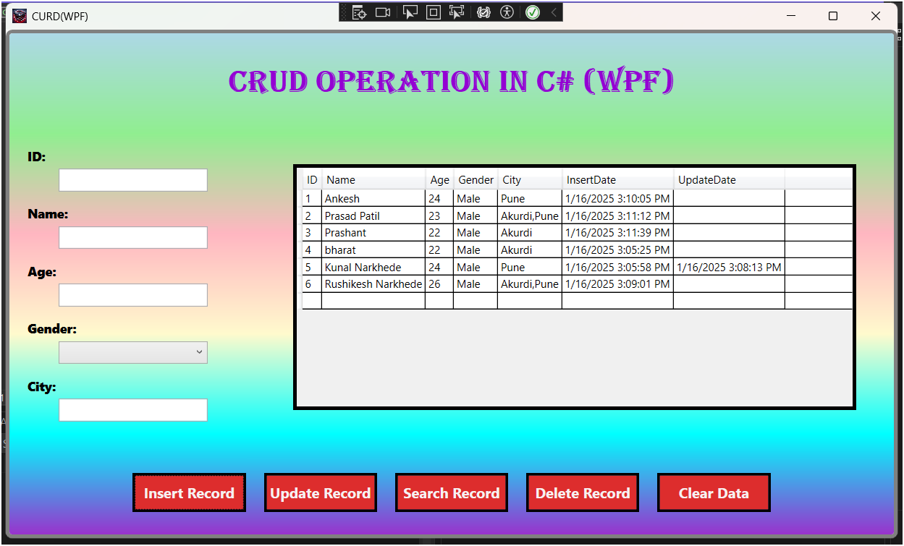

# WPF CRUD Operation Application  

This project is a GUI-based application built using **Windows Presentation Foundation (WPF)** to demonstrate **Insert Record, Update Record, Delete Record, Search Record, and Clear Data** functionalities.

---

## Features  

- **Insert Record**: Add new records through a user-friendly form.  
- **Update Record**: Modify existing records effortlessly.  
- **Delete Record**: Remove records securely with confirmation prompts.  
- **Search Record**: Quickly locate specific records using filters or keywords.  
- **Clear Data**: Reset input fields to clear the current form for a fresh start.  

---

## Technologies Used  

- **Framework**: .NET Framework  
- **UI Technology**: Windows Presentation Foundation (WPF)  
- **Programming Language**: C#  
- **Database**: SQL Server  

---

